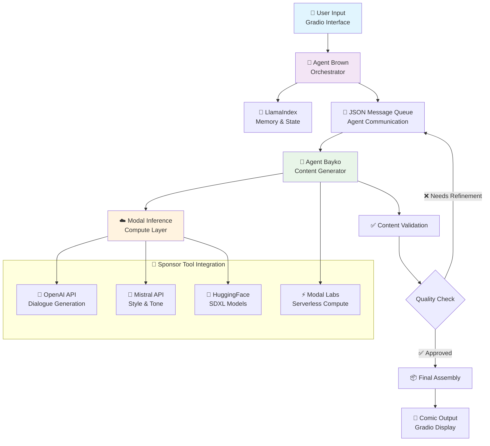

# Agentic Comic Generator


> 🎨 Multi-agent AI system for generating comic panels from story prompts

A multi-agent AI system that transforms user prompts into illustrated comic panels. Agent Brown handles narrative logic and dialogue. Agent Bayko renders the visuals. Designed as an experiment in agent collaboration, creative storytelling, and generative visuals.

## 🎗️Key Features

- Modular agents for dialogue and image generation
- Prompt-to-panel storytelling pipeline
- Gradio-powered web interface
- Easily extendable for TTS, styles, or emotion tagging

## ✍️ Status

Currently under active development for experimentation and portfolio.

## 📁 Directory Structure

```text
  project-root/
├── app.py                     # Entrypoint for Gradio
├── api/                       # FastAPI routes and logic
├── agents/
│   ├── brown.py
│   └── bayko.py
├── plugins/
│   ├── base.py
│   └── tts_plugin.py
├── services/
│   └── ai_service.py
├── config.py
├── modal_app.py
├── storyboard/                # Where all output sessions go
│   └── session_xxx/
├── requirements.txt
├── README.md
└── tech_specs.md
```

## 💡 Use Case

A user enters a storytelling prompt via a secure WebUI.  
The system responds with:

- Stylized dialogue
- Rendered comic panels
- Optional voiceover narration

Behind the scenes, two agents — Bayko and Brown — process and generate the comic collaboratively while remaining isolated via network boundaries.

---

## 📞 Agent Communication & Storage

## 👥 Agent Roles

Two core agents form the backbone of this system:

- 🤖 **Agent Brown** – The front-facing orchestrator. It receives the user’s prompt, tags the style, validates inputs, and packages the story plan for execution.
- 🧠 **Agent Bayko** – The creative engine. It handles image, audio, and subtitle generation based on the structured story plan from Brown.

Each agent operates in isolation but contributes to the shared goal of generating cohesive, stylized comic outputs.

### Agent Brown

- 🔹 Input validator, formatter, and storyboard author
- ✨ Adds style tags ("Ghibli", "tragedy", etc.)
- 📦 Writes JSON packages for Bayko
- 🛡️ Includes moderation tools, profanity filter

### Agent Bayko

- 🧠 Reads storyboard.json and routes via MCP
- 🛠️ Toolchain orchestration (SDXL, TTS, Subtitler)
- 🎞️ Output assembly logic
- 🔄 Writes final output + metadata

Brown and Bayko operate in a feedback loop, refining outputs collaboratively across multiple turns, simulating human editorial workflows.

## 🔁 Agent Feedback Loop

This system features a multi-turn agent interaction flow, where Brown and Bayko collaborate via structured JSON messaging.

### Step-by-Step Collaboration

1. **User submits prompt via WebUI**  
   → Brown tags style, checks profanity, and prepares a `storyboard.json`.

2. **Brown sends JSON to Bayko via shared storage**  
   → Includes panel count, style tags, narration request, and subtitles config.

3. **Bayko processes each panel sequentially**  
   → For each, it generates:

   - `panel_X.png` (image)
   - `panel_X.mp3` (narration)
   - `panel_X.vtt` (subtitles)

4. **Brown reviews Bayko’s output against the prompt**

   - If all panels match: compile final comic.
   - If mismatch: returns annotated JSON with `refinement_request`.

5. **UI reflects agent decisions**  
   → Shows messages like “Waiting on Bayko…” or “Refining… hang tight!”

This feedback loop allows for **multi-turn refinement**, **moderation hooks**, and extensibility (like emotion tagging or memory-based rejections).

### User Interaction

- When the user submits a prompt, the system enters a "processing" state.
- If Brown flags an issue, the UI displays a message such as “Refining content… please wait.”
- This feedback loop can be extended for multi-turn interactions, allowing further refinement for higher-quality outputs.

This modular design not only demonstrates the agentic behavior of the system but also allows for future expansions such as incorporating memory and adaptive feedback over multiple turns.

## ⚙️ Example Prompt

```text
Prompt: “A moody K-pop idol finds a puppy on the street. It changes everything.”
Style: 4-panel, Studio Ghibli, whisper-soft lighting
Language: Korean with English subtitles
Extras: Narration + backing music
```

For detailed multi-turn logic and JSON schemas, see [Feedback Loop Implementation](./tech_specs.md#-multi-turn-agent-communication).

---

## 🧠 System Architecture

### 🏗️ Technical Overview

The system combines **FastAPI** backend services, **Gradio** frontend, **Modal** compute scaling, and **LlamaIndex** agent orchestration to create a sophisticated multi-agent workflow.


